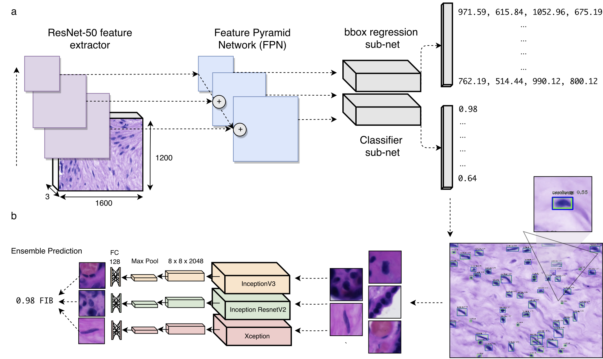

# Towards Deep Placental Histology Phenotyping

## Introduction:




## Nuclei detector

To train RetinaNet with COCO-pretrained weights, run:

```
keras_retinanet/bin/train.py --epochs 100 --weights resnet50_coco_best_v1.2.2.h5 --steps 71 --batch-size 1 csv train_nuclei_annotations.csv class_mapping.txt --val-annotations valid_nuclei_annotations.csv 
```

To evaluate our model (resnet50_csv_37.h5) on the test images, run:

```
keras_retinanet/bin/evaluate.py --max-detections 500 --score-threshold 0.50 --save-path detections/ csv test_nuclei_annotations.csv class_mapping.txt ./snapshots/resnet50_csv_37.h5 
```

## Cell classification and deep embeddings

## Model Weights:

RetinaNet COCO-pretrained: <links here>
  
RetinaNet placenta histology:

FCNN-Unet weights:

InceptionV3:

InceptionResNetV2:

Xception:
